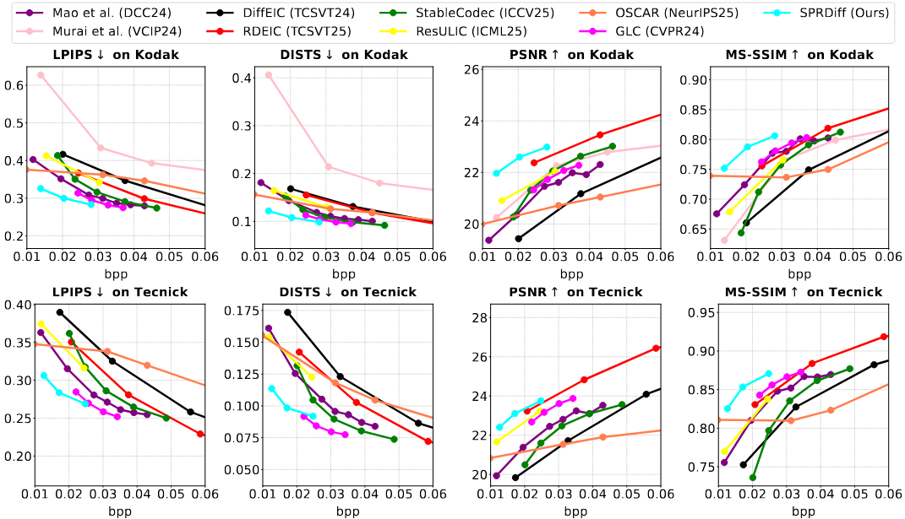
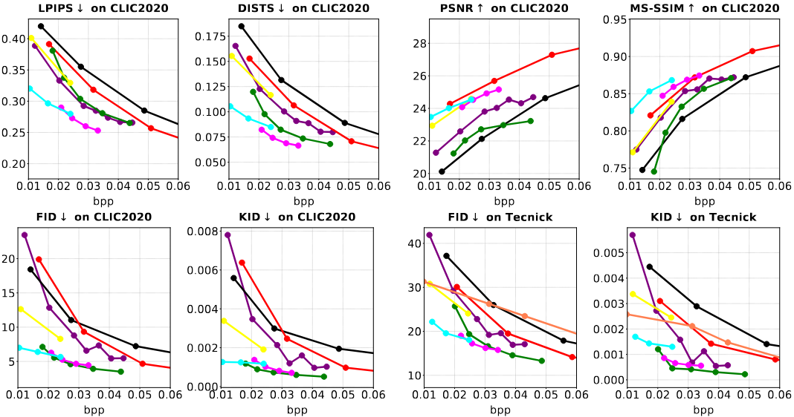
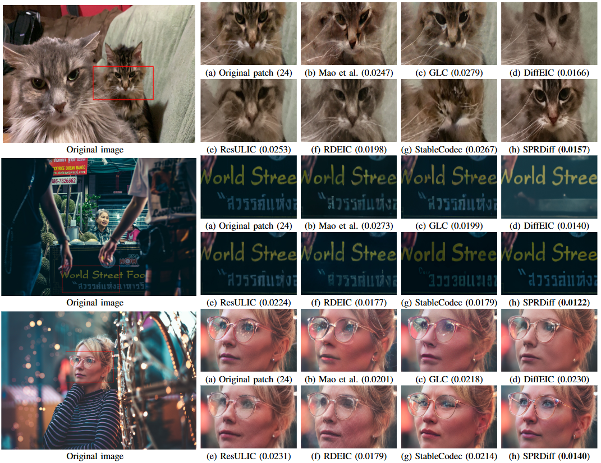

# SPRDiff

[Hao Wei](https://scholar.google.com.hk/citations?user=hhNFVW0AAAAJ&hl=zh-CN), Yanhui Zhou, Chenyang Ge, [Saeed Anwar](https://scholar.google.com.hk/citations?user=vPJIHywAAAAJ&hl=zh-CN), [Ajmal Mian](https://scholar.google.com.hk/citations?user=X589yaIAAAAJ&hl=zh-CN).

#### 🔥🔥🔥 News

- **2025-12-01:** This repo is released.

## 🔗 Contents

- [x] [Datasets](#Datasets)
- [ ] [Installation](#Installation) 
- [ ] [Models](#Models)
- [ ] [Train and Test](#TrainAndTest)
- [x] [Results](#Results)
- [ ] [Citation](#Citation)
- [ ] [Acknowledgements](#Acknowledgements)

## 📊 Datasets
Following [ResULIC](https://github.com/NJUVISION/ResULIC), we train the proposed SPRDiff on [LSDIR](https://ofsoundof.github.io/lsdir-data/) + [Flicker2W](https://github.com/liujiaheng/CompressionData) datasets and then evaluate it on the [Kodak](https://r0k.us/graphics/kodak/), [Tecnick](https://testimages.org), and [CLIC2020](https://clic2025.compression.cc/) datasets.

##  🔎 Results

&ensp;Quantitative Comparisons (click to expand) 

&ensp;Visual Comparisons (click to expand) 

## 💡 Acknowledgements
